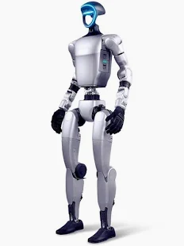
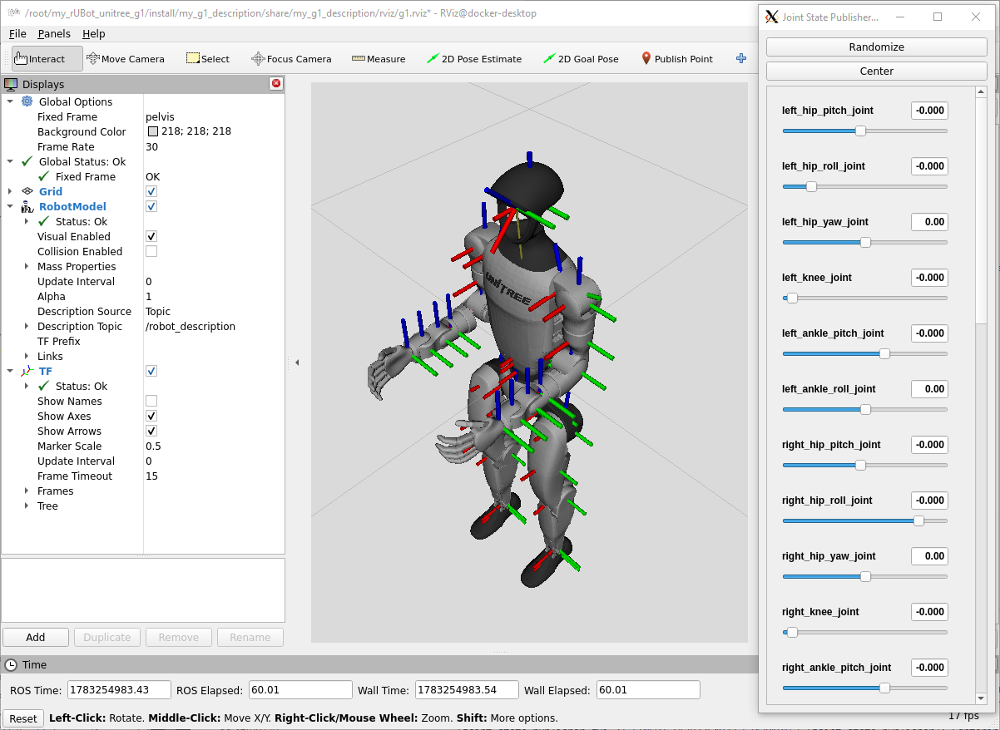
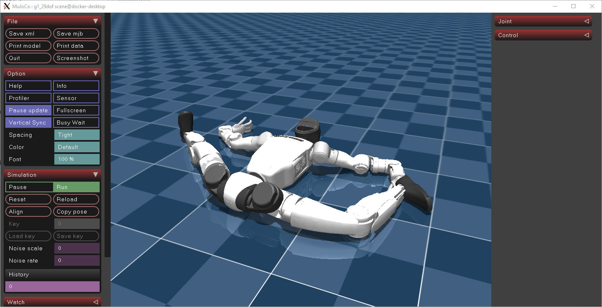

# **Unitree setup**

The Unitree robot:

|  |  |
|:------------:|:-------------:|
| Default pose | Standing pose |

- In Host PC, clone the repository and run the setup script to set up your workspace:

```bash
git clone https://github.com/github_user/my_rUBot_unitree_g1/unitree_g1.git
cd Documentation/Files/Docker_Humble
docker compose up
````

- In Docker Container, clone the repository and run the setup script to set up your workspace:

```bash
git clone https://github.com/github_user/my_rUBot_unitree_g1/unitree_g1.git
cd unitree_g1
chmod +x Documentation/Files/scripts/*.sh
bash Documentation/Files/scripts/setup_install.sh
```
- Compile:

```bash
colcon build --symlink-install
```
- Launch the robot description and RViz:

```bash
ros2 launch my_g1_description display_g1.launch.py
```


## 5. Launch the Official MuJoCo Simulator

```bash
bash Documentation/Files/scripts/run_g1_mujoco.sh
```

This launches the official Unitree MuJoCo simulator using the **29-DoF G1 model**.

The simulator loads:

- the complete G1 kinematic model;
- all 29 actuated joints;
- IMU sensors;
- joint position, velocity and torque sensors;
- the official Unitree DDS communication interface.



### Initial robot behaviour

When the simulator starts, the G1 appears in its default standing configuration.

However, **the robot immediately falls to the ground**.

This behaviour is completely expected.

Although the robot model contains 29 actuated joints, **no control commands are being sent to the motors**. Therefore, the joints behave as passive joints and cannot generate the torques required to support the robot against gravity.

The simulator only provides:

- the robot dynamics;
- the physical environment;
- gravity;
- collisions;
- sensors;
- communication interfaces.

It does **not** include a balance controller.

Consequently, the G1 behaves like a real humanoid robot with its motors switched off.

### Next step

To keep the robot standing, a controller must continuously send commands to all actuators.

In the next example package (`my_g1_examples`), a first **joint-space position controller** is implemented. This controller continuously publishes desired joint positions using the Unitree `LowCmd` interface.

The joints become stiff and attempt to maintain a predefined posture. However, since no balance algorithm is implemented yet, the robot may still fall forward or backward.

Future improvements will include:

- IMU-based balance feedback;
- centre-of-mass stabilization;
- ankle and hip compensation;
- Whole-Body Control (WBC) for dynamic balancing and locomotion.