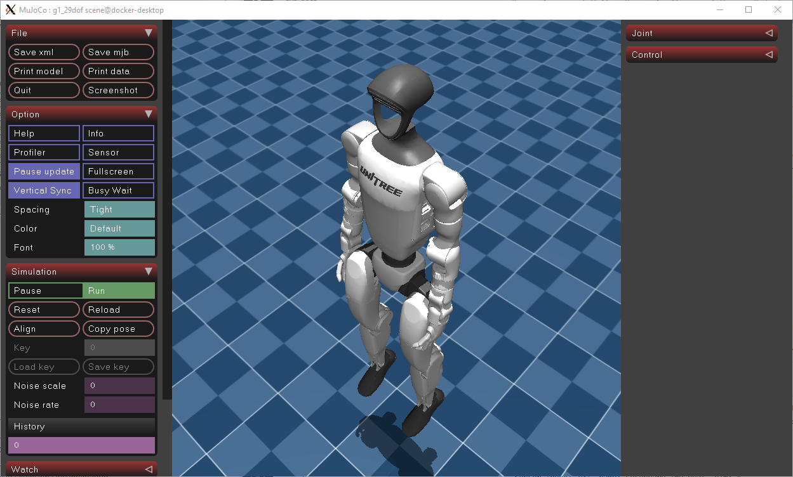
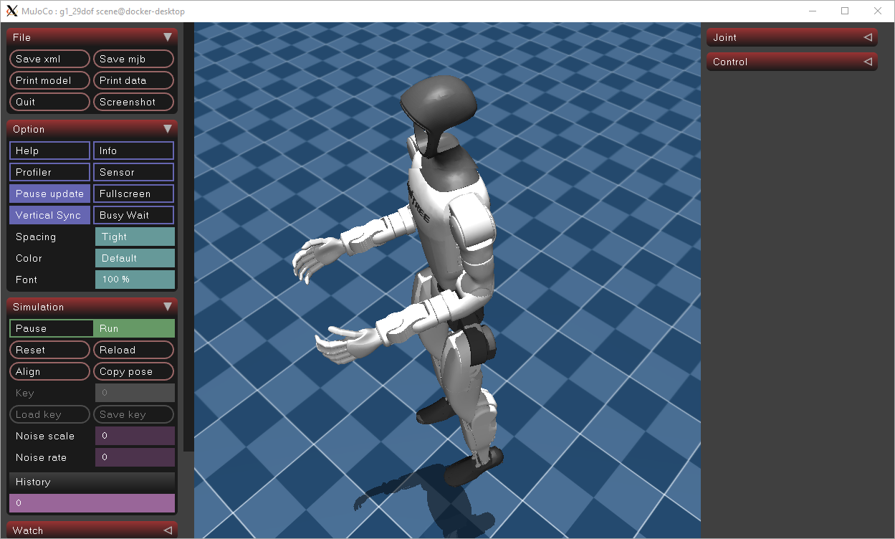

# G1 Motion Examples

This package contains the first motion-control examples for the **Unitree G1** humanoid robot using the official **Unitree MuJoCo** simulator.

The objective is to progressively move from the official Unitree SDK examples towards our own ROS 2 educational examples.

The complete learning path is:

```text
Official Unitree MuJoCo
        ↓
Official SDK2 Examples
        ↓
Understand LowCmd / LowState
        ↓
Develop our own ROS2 examples
        ↓
MoveIt2
        ↓
Whole-Body Control
```

---

# 1. Official Unitree Examples

Before developing our own ROS 2 packages, it is highly recommended to become familiar with the examples provided by Unitree.

The official repositories include numerous examples for the G1 humanoid.

## SDK2 Examples

Located in:

```text
src/unitree_sdk2/example/
```

Compiled executables:

```text
src/unitree_sdk2/build/bin/
```

Some of the available examples are:

| Example | Description |
|----------|-------------|
| g1_ankle_swing_example | Low-level ankle motion example |
| g1_arm_action_example | Arm motion example |
| g1_arm5_sdk_dds_example | 5-DoF arm SDK example |
| g1_arm7_sdk_dds_example | 7-DoF arm SDK example |
| g1_dual_arm_example | Coordinated dual-arm motion |
| g1_dex3_example | Dexterous hand example |
| g1_audio_client_example | Audio client |
| g1_hand_sdk_example | Hand SDK example |
| g1_userctrl_dds_example | Low-level user control |
| g1_loco_client | High-level locomotion client (requires locomotion service) |

---

## MuJoCo Examples

The official MuJoCo repository also contains examples located in

```text
src/unitree_mujoco/example/
```

These examples demonstrate how to communicate with the simulator using Unitree SDK2.

---

# 2. Launching MuJoCo

We provide our own launcher script inside the repository.

```text
Documentation/
└── Files/
    └── g1_examples/
        └── run_g1_mujoco.sh
```

Launch the simulator:

```bash
cd ~/my_rUBot_unitree_g1

bash Documentation/Files/g1_examples/run_g1_mujoco.sh
```

The launcher automatically:

- configures the simulator for the **G1 29-DoF** model;
- selects the loopback interface (`lo`);
- configures the DDS domain;
- enables the virtual elastic band to keep the robot suspended during the first low-level experiments;
- launches the official Unitree MuJoCo simulator.

The launcher does **not** modify the official Unitree source code.

It only updates the simulator configuration before launching MuJoCo.

---

# 3. Running Official SDK2 Examples

We also provide launcher scripts for the official Unitree SDK2 examples.

```text
Documentation/
└── Files/
    └── g1_examples/
        ├── run_g1_ankle_swing.sh
        ├── run_g1_arm_action.sh
        ├── run_g1_dual_arm.sh
        └── ...
```

Example:

```bash
bash Documentation/Files/g1_examples/run_g1_ankle_swing.sh
```

These scripts automatically:

- clean the ROS environment when required;
- configure the required library paths;
- execute the official SDK2 example.

The first recommended example is:

```text
g1_ankle_swing_example
```

This example verifies that:

- MuJoCo is running correctly;
- DDS communication is working;
- LowCmd commands reach the simulator;
- the robot joints become stiff and execute ankle motions.


|  |  |
|:------------:|:-------------:|
| g1 hold with elastic band | g1 moving ankle swing |

---

# 4. Developing Our Own ROS2 Examples

Once the official examples work correctly, we can begin developing our own educational ROS 2 nodes.

Repository structure:

```text
my_g1_examples/
├── config/
│   └── g1_poses.yaml
├── my_g1_examples/
│   └── g1_pose_player.py
├── package.xml
└── setup.py
```

The objective is to replace the official SDK examples with our own ROS 2 nodes.

Eventually the control chain becomes

```text
YAML pose file
        ↓
g1_pose_player
        ↓
LowCmd publisher
        ↓
Unitree MuJoCo
```

---

# 5. Pose Player

The node `g1_pose_player`:

- loads a pose from a YAML file;
- assigns a desired joint position;
- continuously publishes LowCmd commands;
- applies a simple joint-space PD controller using `kp` and `kd`.

Example:

```bash
ros2 run my_g1_examples g1_pose_player \
    --ros-args -p pose:=stand
```

The available poses are defined in

```text
my_g1_examples/config/g1_poses.yaml
```

Example:

```yaml
stand:
  kp: 80.0
  kd: 4.0
  joints:
    left_hip_pitch: -0.35
    left_knee: 0.70
    left_ankle_pitch: -0.35
    right_hip_pitch: -0.35
    right_knee: 0.70
    right_ankle_pitch: -0.35
```

---

# 6. Current Behaviour

With the current implementation:

- the joints become stiff;
- the desired posture is tracked;
- the robot still requires the virtual elastic band.

This is expected.

The controller is currently a simple **joint-space PD controller**.

It does **not** implement humanoid balance.

---

# 7. Why the Robot Falls

A humanoid cannot remain standing simply by commanding joint angles.

A complete balance controller must also consider:

- centre of mass;
- support polygon;
- pelvis orientation;
- torso attitude;
- IMU measurements;
- foot contact forces;
- ankle and hip compensation.

Our current controller intentionally ignores these aspects in order to understand the low-level control architecture first.

---

# 8. Next Development Steps

The recommended progression is:

```text
Official SDK2 Examples
            ↓
ROS2 LowCmd Publisher
            ↓
YAML Pose Player
            ↓
IMU Feedback
            ↓
Simple Balance Controller
            ↓
Whole-Body Controller
            ↓
MoveIt2 Integration
            ↓
Real G1 Robot
```

A first balance controller could simply compensate body inclination using the IMU:

```text
Torso pitch
        ↓
Hip pitch correction
        ↓
Ankle pitch correction
```

Later, a Whole-Body Controller (WBC) could coordinate:

- both legs;
- torso;
- arms;
- centre of mass;
- foot contacts.

---

# 9. Summary

Current project status:

```text
✓ Unitree MuJoCo running

✓ Official SDK2 examples

✓ DDS communication

✓ LowCmd / LowState understanding

✓ ROS2 package structure

✓ YAML pose definitions

✓ Joint-space PD control

□ IMU feedback

□ Balance controller

□ Whole-Body Control

□ MoveIt2 integration

□ Real robot experiments
```

This workflow follows a progressive educational approach:

1. Understand the official Unitree software.
2. Verify communication using the official SDK examples.
3. Develop equivalent ROS 2 examples.
4. Add balance control.
5. Integrate MoveIt2.
6. Deploy on the real G1 humanoid.